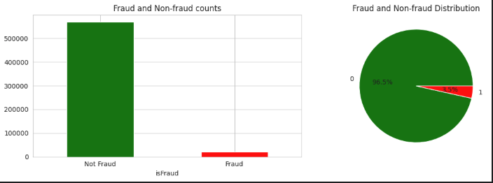
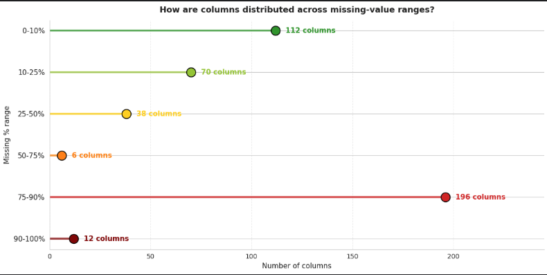
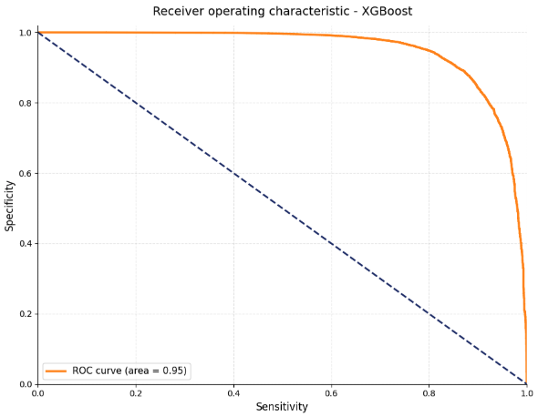

# IEEE_CIS Fraud Detection - ML Assignment 2

## კონკურსის მიმოხილვა

ეს კონკურსი ეხება კლასიფიკაციის ამოცანას, კერძოდ ჩვენი მიზანია მოცემული ტრანზაქციის მიხედვით გავიგოთ ეს ტრანზაქცია ნამდვილია თუ ყალბი მისი მახასიათებლების საფუძველზე.
ამოცანა ფასდება AUROC მეტრიკით (Area under the ROC curve) predicted ალბათობასა და observed target-ს შორის.



## მიდგომა
ეს ამოცანა კლასიფიკაციის ამოცანაა, ვინაიდან, უნდა გავარკვიოთ ტრანზაქცია ნამდვილია თუ არა (ანუ გვაქვს ორი target მნიშვნელობა). შესაბამისად უნდა გამოვიყენოთ კლასიფიკაციის მოდელები. ჩემ მიერ არჩეული მოდელები შემდეგია: **Logistic Regression**, **Random Forest**, **AdaBoost** და **XGBoost**. აქედან ერთი წრფივი მოდელია. დანარჩენები კი ensemble მოდელებია. თუმცა სანამ მათ ტრენინგზე გადავიდოდი შევხედე მონაცემებს EDA ფაზაში(ამის ნოუთბუქიც ცალკე მაქვს ყველა სხვა ნოთბუქში ცალცალკე რომ აღარ მეწერა). ყველა მოდელისთვის data-ს ვყოფ 80/20 ად, trainging და test სეტად. თითოეული მოდელისთვის შემდეგი ფაზაა **Feature Cleaning / Preprocessing** ფაზა სადაც ისეთ სვეტებს ვყრი, რომელსაც ბევრი NAN მნიშვნელობა აქვს. შემდეგი ფაზაა Feature Engineering სადაც ახალ feature-ებს ვამატებ. ასევე კატეგორიულ ცვლადებს გარდავქმნი რიცხვითში, რათა მოდელებმა იმუშაონ და დარჩენილ სვეტებს missing value-თი ვავსებ Imputer ით. შემდეგ მოდის **Feature Selection** ფაზა სადაც თითოეული მოდელისთვის სხვადასვა selection მეთოდებს ვტესტავ, ვირჩევ საუკეთესოს და საბოლოო train და test სეტით ვატრენინგებ მოდელებს. საბოლოოდ ყველა run-ს ვლოგავ mlflow -ზე და თითოეულისთვის საუკეთესო pipeline-ს ვლოგავ მისი მოდელით, რადგან inference ში შემეძლოს raw სეტზე პაიპლაინის პირდაპირ გაშვება.

## რეპოზიტორიის სტრუქტურა

```
ML_assignment_2/
├── images/
├── EDA.ipynb   
├── model_experiment_LogisticRegression.ipynb   
├── model_experiment_RandomForest.ipynb     
├── model_experiment_AdaBoost.ipynb    
├── model_experiment_XGBoost.ipynb     
├── model-inference.ipynb
└── README.md
```
## ფაილების აღწერა

| ფაილი | აღწერა |
|-------|--------|
| `images` | სურათები EDA დან |
| `EDA.ipynb ` | ნოუთბუქი Explanatory Data Analysis -თვის |
| `model_experiment_LogisticRegression.ipynb ` | ნოუთბუქი LogisticRegression-ის ტრენინგისთივის |
| `model_experiment_RandomForest.ipynb  ` | ნოუთბუქი RandomForest-ის ტრენინგისთივის |
| `model_experiment_AdaBoost.ipynb ` | ნოუთბუქი AdaBoost-ის ტრენინგისთივის |
| `model_experiment_XGBoost.ipynb    ` | ნოუთბუქი XGBoost-ის ტრენინგისთივის |
| `model-inference.ipynb` | საუკეთესო მოდელის ჩამოტვირთვა და kaggle-სთვის submission-ის შექმნა |
| `README.md` | პროექტის დოკუმენტაცია |

---

## მონაცემთა დამუშავება / გაწმენდა (Data Preprocessing / Cleaning)

### 1. Useless სვეტების გადაყრა

`TransactionID` არის უბრალო ID-ი, რომელსაც არანაირი predictive ღირებულება არ აქვს და მოდელის შესწავლისას მხოლოდ noise-ი იქნება, რადგან ის უბრალოდ ტრანზაქციის უნიკალური იდენთიფიკატორია(ეს კი შეიძლება შემთხვევითად გენერირებულიც არის). შესაბამისად ის გადავყარე.

### 2. NaN მნიშვნელობებიანი სვეტების დამუშავება



დატასეტის ერთ-ერთი მთავარი გამოწვევაა missing values ანუ იგვე NAN მნიშვნელობები. შესაბამისად შემოვიღე ესეთი მეთოდი. მაქვს ორი threshold-ი:

- **>75% NaN** - მთლიანად ვდროპავ სვეტს.
- **25%-დან 75%-მდე NaN** - ვამატებ binary missing flag-ს `<სვეტის სახელი>_missing` სახელით. NaN-ის ყოფნა შეიძლება ინფორმაციული სიგნალი იყოს ამიტომ, ვარჩიე რომ თუ ძალიან ბევრი missing არ აქვს სვეტს მაშინ უბრალოდ ეს სვეტები მომენიშნა.

### 3. Imputation

დარჩენილი NaN-ებისთვის ვიყენებ `SimpleImputer(strategy='median')`-ს, რადგან median უფრო მდგრადია outlier-ების მიმართ ვიდრე mean.

- **XGBoost-ში Imputation:** XGBoost-ს არ სჭირდება missing value ების შევსება Imputer-ით. ყოველ split-ზე ის თვითონ წყვეტს, რომელ მხარეს გაგზავნოს missing values. ამიტომ XGBoost-ის pipeline-ში imputer-ს არ ვიყენებ. ეს ერთ-ერთი მისი მთავარი უპირატესობაა სხვა მოდელებთან შედარებით.

---
## Feature Engineering

ყველა მოდელისთვის FeatureAdder transformer-ს ვიყენებ, რომელიც ქმნის შემდეგ ახალ ცვლადებს:

### 1. TransactionAmt-ის ტრანსფორმაციები

- `TransactionAmt_logarithm` = `log(1 + TransactionAmt)` — გადააქვს ტრანზაქციების რაოდენობების skewed განაწილება უფრო ნორმალურთან. როგორც EDA-ში ვნახე ეს განაწილება მარცხნივ იყო გადახრილი.

- `TransactionAmt_cents` = `TransactionAmt % 1` — ცენტების რაოდენობა (შეიძლება რამეს ნიშნავდეს. თუ თანხის რაოდენობა .0 ზე მთავრდება ან არ მთავრდება).

### 2. დროითი feature-ები TransactionDT-დან

- `hour_of_transaction` ტრანზაქციის დრო - საათი.
- `day_of_transaction` ტრანზაქციის დრო - კვირა დღე.

EDA-ში ვნახე, რომ დროზე დამოკიდებულია fraud-ი.

### 3. User-id აგრეგაციები

ხელოვნურ `user_id'-ს ვქმნი `card1_card2_addr1_P_emaildomain` შერწყმით. შემდეგ თითოეული user-ისთვის გამოვითვლი:

- `user_tr_count` — რამდენ ტრანზაქციას აკეთებს ეს user-ი.
- `user_amt_mean` — საშუალო თანხა.
- `user_amt_standart_dev` — თანხის სტანდარტული გადახრა.
- `user_amt_zscore` = `(amt - mean) / std` — როგორ განსხვავდება ეს ტრანზაქცია user-ის ჩვეულებრივ პატერნისგან.
- `user_tr_count_logarithm` = `log(count)`. - ტრანზაქციების რაოდენობის ლოგარითმი.


### 4. Categorical Encoding

ყველა object-ტიპის სვეტს(კატეგორიულებს) Label Encoding-ით ვცვლი (NaN -> "missing", unseen categories -> "missing"). ეს One-Hot Encoding-ს იმით შეიძლება ჯობდეს, რომ one-hot-მა შეიძლება ძალიან ბევრი ახალი სვეტი დაამატოს (DeviceInfo-ს მაგალითად 1786 უნიკალური მნიშვნელობა აქვს. One-Hot აქ უბრალოდ შეუძლებელი იქნებოდა თუ Data Cleaning ასეთ სვეტებს არ გადაყრიდა მანამდე).

---


## Feature Selection

- ეს ფაზა XGBoost-ს არ ეხება, რადგან მას ჩაშენებული selector-ი ისედაც აქვს.

- Logistic Regression-ისთვის გავტესტე ორი სხვადასხვა(Correlation only და IV + Correlation) ხოლო tree-based მოდელებისთვის (RF, AdaBoost) დავტესტე სამი სხვადასხვა სელექციის/ფილტრის სტრატეგია(Correlation only, IV + Correlation, TreeImportance):


### 1. Correlation Filter

ფილტრავს იმ ცვლადებს, რომლებიც ერთმანეთთან 0.9-ზე მეტადაა კორელირებული. (0.9 threshold ი ისედაც ბევრ ცვლადს ყრიდა ამიტომ მასზე დაბალი აღარ ავიღე). წყვილებიდან ერთს ტოვებს ეს ფილტრი (ნაკლებად redundant-ს). სვეტებს შორის საბოლოოდ კოლინეარულობა მცირდება.  სვეტების რაოდენობა 277-დან **148**-მდე მცირდება.

### 2. IV (Information Value) + Correlation

IV (Information Value) ზომავს თითოეული feature-ის predictive power-ს. threshold = 0.02  IV თუ ნაკლებია 0.02 ზე ამ სვეტებს გადავყრით). შემდეგ Correlation Filter-ი ფილტრავს redundant ცვლადებს. სვეტების რაოდენობა 277 -> 192 -> **106**.

### 3. Tree Importance

ვატრენინგებ პატარა Random Forest-ს (n_estimators=50, max_depth=10) პარამეტრებით,  ვტოვებ top 80 ცვლადს რომელსაც ყველაზე დიდი importance მიანიჭა ამ RandomForest-მა. ამ მიდგომამ **tree-based** მოდელებში საუკეთესო შედეგი მოიტანა, ვინაიდან tree importance იჭერს არაწრფივ დამოკიდებულებებს, რომელსაც ზედა ორი ფილტრი შეიძლება ვერ ამჩნევდეს კარგად.

--
ეს სამივე ფილტრი გავტესტე baseline მოდელებზე ერთჯერადად. საუკეთესო შედეგის მქონე filter თითოეული მოდელისთვის ავირჩიე საბოლოო ფილტრად Training და Hyperparameter tuning ფაზისთვის. LR-ისთვის IV+Corr ავირჩიე იმიტომ, რომ 30% ნაკლები feature-ით (106 vs 148) იგივე შედეგი მიიღო დაახლოებით ამიტომ, ტრენინგი უფრო სწრაფი იქნებოდა tuning-ის ფაზაში. Tree based მოდელებში კი TreeImportance ფილტრმა უკეთესი შედეგი დადო, ვიდრე ამ ფილტრის გარეშე.

(ფილტრს იგივე Feature Selector-ს ვეძახი) 

| მოდელი | Correlation only | IV+Corr | Tree Importance  | საბოლოო არჩევანი |
|--------|------------------------|---------------|----------------------|--------------|
| **LR** | val AUC: 0.8296 | val AUC: 0.8291 | — | **IV+Corr** (ნაკლები features და თითქმის იგივე AUC) |
| **RF** | val AUC: 0.8855 | val AUC: 0.8881 | val AUC: 0.8986 | **Tree Importance** |
| **AdaBoost** | val AUC: 0.8440 | val AUC: 0.8418 | val AUC: 0.8589 | **Tree Importance** |


---
## ტრენინგი და ექსპერიმენტები

| მეტრიკა | აღწერა |
|---------|--------|
| `train_auc` | AUC train set-ზე |
| `test_auc` | AUC test set-ზე |
| `auc_diff` | train - test (overfitting indicator) |
| `train_f1`, `test_f1` | F1 score train/test |
| `train_precision`, `test_precision` | Precision train/test |
| `train_recall`, `test_recall` | Recall train/test |

class imbalance-ის გასათვალისწინებლად ვიყენებ `class_weight='balanced'. როგორც EDA ში ვნახეთ დაახლოებით 97% ია non-fraud ტრანზაქცია.


### 1. Logistic Regression

ვტესტავ სხვადასხვა `C`-ს (C რეგულარიზაციის პარამეტრია) და `penalty` (l1/l2). LR-ისთვის ცალკე Cross Validation (5-fold) გავუშვი default config-ზე. საშუალო val AUC = 0.8283 ± 0.0031, რამაც მიმანიშნა, რომ ეს სტაბილური მოდელია და აქამდე ყველაფერი ნორმალურად გავაკეთე.

- C ები: [0.0001, 0.01, 0.1, 1.0, 10.0, 100.0, 10000.0]
- penalty : l1 და l2

გავტესტე მათი კომბინაციები და დავლოგე top3 საუკეთესო და top3 უარესი მოდელი.

#### Logistic Regression შედეგები (top 3 best + top 1 worst)

**Top 3 საუკეთესო მოდელი test_auc მიხედვით:**

| hyperparameters | train_auc | test_auc | diff | test_f1 | test_recall | test_precision |
|--------|-----------|----------|------|---------|-------------|----------------|
| **C=0.1, l1** | 0.8298 | **0.8291** | +0.0007 | 0.1735 | 0.7464 | 0.0981 |
| C=1.0, l1 | 0.8298 | 0.8291 | +0.0007 | 0.1735 | 0.7464 | 0.0981 |
| C=10.0, l1 | 0.8298 | 0.8291 | +0.0007 | 0.1735 | 0.7464 | 0.0981 |


**ყველაზე ცუდი მოდელი**
| hyperparameters | train_auc | test_auc | diff |
|--------|-----------|----------|------|
| C=0.0001, l1 | 0.8083 | 0.8060 | -0.0023 | 

- **overfit**-ი C = 0.0001  მაც კი არ მომცა, რაც საინტერესო შედეგია. შეიძლება მოდელს იმიტომ უჭირს overfit, რომ ცვლადების რაოდენობა (106 IV+Corr-ის შემდეგ) გაცილებით ნაკლებია train sample-ის ზომაზე და ხმაურის სწავლაც უჭირს.

- **underfit**-იც არაა გამოკვეთილი ამ მოდელებში. ყველაზე ცუდ მოდელს თუ შევხედავთ ის 0.2 ით ჩამორჩება საუკეთესო მოდელის test_auc შედეგს. შეიძლება ითქვას, რომ მცირე underfit გვაქვს ამ შემთხვევაში, მაგრამ არაფერი გრანდიოზული.
 
- შესაძლებელია, რომ C -ს ძალიან დიდ მნიშვნელობებზე მოეცა overfit მაგრამ ეს აღარ გამიტესტია. მაგრამ საინტერესო შედეგი რაც მივიღეთ აქ არის ის, რომ ამ პარამეტრებზე overfit- არ გვაქვს. მაგრამ გვაქვს მცირე underfit სხვა მოდელების შედეგებს თუ შევადარებთ.

ასევე საინტერესოა LR-ის precision/recall პროფილი: მაღალი recall (დაახლოებით 0.75), დაბალი precision (დაახლოებით 0.10). ეს მოდელი აგრესიულია fraud-ის დაპრედიქტებისას, ბევრი false alarm-ით.

აქედან ავირჩიე პირველი მოდელი საუკეთესოდ, top 3 საუკეთესო მოდელიდან და დავლოგე mlflow ზე თავისი პაიპლაინით. ასევე დავარეგისტრირე Models-ში.


### 2. Random Forest

გავტესტე რამდენიმე ჰიპერპარამეტრების კონფიგურაცი , რომელიც მოიცავს `n_estimators` - [10, 50, 100, 200, 300, 500], `max_depth` - {2, 3, 5, 10, 15, 20, None}, `min_samples_leaf` ∈ {1, 5, 10, 20, 50}.

| Config | train_auc | test_auc | diff | test_f1 | test_precision | test_recall |
|--------|-----------|----------|------|---------|----------------|-------------|
| n=500, d=None, l=1 | 1.0000 | 0.9460 | +0.0540 | 0.5970 | 0.9421 | 0.4370 |
| n=300, d=None, l=1 | 1.0000 | 0.9453 | +0.0547 | 0.5969 | 0.9416 | 0.4370 | 
| n=200, d=None, l=1 | 1.0000 | 0.9435 | +0.0565 | 0.5952 | 0.9399 | 0.4355 | 
| n=100, d=None, l=1 | 1.0000 | 0.9383 | +0.0617 | 0.5925 | 0.9401 | 0.4326 | 
| n=200, d=20, l=5 | 0.9921 | 0.9379 | +0.0541 | 0.5908 | 0.5501 | 0.6380 |
| n=300, d=20, l=1 | 0.9941 | 0.9345 | +0.0596 | 0.5971 | 0.5973 | 0.5969 | 
| n=300, d=15, l=5 | 0.9681 | 0.9252 | +0.0429 | 0.4631 | 0.3438 | 0.7094 |
| n=200, d=15, l=5 | 0.9684 | 0.9250 | +0.0434 | 0.4653 | 0.3459 | 0.7106 |
| n=100, d=10, l=1 | 0.9159 | 0.8986 | +0.0173 | 0.3021 | 0.1883 | 0.7643 |
| **n=200, d=10, l=5** **არჩეული** | **0.9148** | **0.8986** | **+0.0162** | **0.2996** | **0.1863** | **0.7653**|
| n=100, d=10, l=5 | 0.9151 | 0.8984 | +0.0167 | 0.3003 | 0.1869 | 0.7641 |
| n=100, d=5, l=10 | 0.8604 | 0.8585 | +0.0019 | 0.2137 | 0.1244 | 0.7568 | 
| n=50, d=3, l=20 | 0.8310 | 0.8323 | -0.0013 | 0.1900 | 0.1089 | 0.7467 | 
| n=10, d=3, l=20 | 0.8263 | 0.8274 | -0.0011 | 0.1928 | 0.1110 | 0.7329 | 
| n=10, d=2, l=50 | 0.8019 | 0.8034 | -0.0015 | 0.1810 | 0.1030 | 0.7455 | 

ეს ცხრილი დალაგებულია test_auc მეტრიკის მიხედვით.

- ზედა მოდელები არ ავირჩიე, რადგან დაზეპირებული აქვთ training data - train_auc 1.0 აქვთ, რაც **overfit** ის ნიშანია. შეიძლება kaggle-ს საბოლოო ტესტზე ამის გამო კარგი შედეგი არ დადონ. ცხადიცაა ზედა მოდელები რატომ აკეთებენ ოვერფიტს: სიღრმის შეზღუდვა საერთოდ არ აქვთ და რეგულარიზაციის პარამეტრიც დაბალი აქვთ l = 1.

- **underfit-ი** ქვედა მოდელებში განსაკუთრებით ჩანს. მათ 0.80 test_auc აქვთ, რაც შედარებით დაბალია. ერთი მიზეზი რაც შეიძლება იყოს არის სიღრმის d-ს სიმცირე. ასეთ შემთხვევაშ d=2,3 ცხადია, თუ რატომ აქვთ შედარებით დაბალი test_auc. ისინი კარგად ვერ დაისწავლიან სიღრმის სიმცირის გამო დატას. ასევე ზოგიერთს მაღალი რეგულარიზაციის პარამეტრიც აქვს, რაც ასევე შეიძლება ამის შედეგი იყოს. n_estimators ის სიდაბლეც როგორც ჩანს underfit -ს იწვევს.

- საბოლოოდ ავარჩიე შუალედური მოდელი, რომელსაც diff ანუ train-სა და ტესტს შორის დიდი განსხვავება არ ჰქონდა და შედარებით კარგი შედეგი ჰქონდა test_auc ში. ამ შემთხვევაში მოდელი უფრო ჯანსაღად ა-general-იზებს შედეგებს.

არჩეული მოდელი დავლოგე თავისი პაიპლაინით mlflow -ზე და დავარეგისტრირე მოდელებში.


### 3. AdaBoost

გავტესტე რამდენიმე ჰიპერპარამეტრების კონფიგურაცია `n_estimators` [5, 10, 50, 100, 200, 300] და `learning_rate` [0.01, 0.1, 0.5, 1.0, 2.0, 3.0].

| Config | train_auc | test_auc | diff | test_f1 | test_precision | test_recall |
|--------|-----------|----------|------|---------|----------------|-------------|
| **n=300, lr=1.0** **არჩეული** | **0.8659** | **0.8638** | +0.0021 | 0.2463 | 0.8108 | 0.1452 | 
| n=200, lr=1.0 | 0.8635 | 0.8618 | +0.0016 | 0.2259 | 0.8044 | 0.1314 | 
| n=100, lr=1.0 | 0.8603 | 0.8589 | +0.0013 | 0.2219 | 0.7765 | 0.1294 | 
| n=100, lr=0.5 | 0.8507 | 0.8493 | +0.0013 | 0.1980 | 0.7433 | 0.1142 | 
| n=50, lr=0.1 | 0.8285 | 0.8285 | +0.0000 | 0.0000 | 0.0000 | 0.0000 |
| n=5, lr=0.01 | 0.5914 | 0.5914 | +0.0001 | 0.1673 | 0.7668 | 0.0939 |
| n=200, lr=2.0 | 0.5471 | 0.5464 | +0.0007 | 0.1673 | 0.7668 | 0.0939 | 
| n=300, lr=2.0 | 0.5471 | 0.5464 | +0.0007 | 0.1673 | 0.7668 | 0.0939 | 
| n=100, lr=3.0 | 0.5471 | 0.5464 | +0.0007 | 0.1673 | 0.7668 | 0.0939 |


- AdaBoost-ი საინტერესო აღმოჩნდა იმ მხრივ, რომ train/test AUC-ს შორის სხვაობა ყოველთვის ძალიან მცირე იყო (მაქსიმალური განსხვავება იყო 0.0021), რაც ნიშნავს, რომ AdaBoost ფაქტობრივად არ ოვერფიტავს ამ შემთხვევაში.

- მიუხედავად ამისა, მივიღე ბევრი გამორჩეული **underfitted** მოდელი. ქვედა ოთხი მოდელი, მაგალითად, ცხადია, რომ ძალიან underfitted- არის. n = 5 ის მოდელს არ ეყო 5 ცალი ხე მთლიანი დამოკიდებულებების სასწავლად. ხოლო შედარებით მაღალი n ებისთვის, ქვედა მოდელებისთვის, learning rate ძალიან მაღალი აღმოჩნდა. ანუ ადაბუსტის ალგორითმი ქვედა სამ შემთხვევაში ძალიან აგრესიულად overcorrect-ს უკეთებს წინა bagging ensemble-ს შედეგს, საბოლოოდ კი საერთოდ ვერ სწავლობს დამოკიდებულებებს.

- აქ კიდევ ერთი საინტერესო შედეგი დავაფიქსირე. AdaBoost-ის precision/recall პროფილი საპირისპიროა **LR-ის**. ანუ ადაბუსტს precision მაღალი აქვს ხოლო recall დაბალი. ხოლო **Logistic Regression** მოდელს პირიქით (**RandomForest** ში ორივე შემთხვევა გვაქვს). ამ შემთხვევაში კეგლი მხოლოდ **ROC AUC** შედეგს ითხოვს, მაგრამ ამოცანის კითხვა რომ სხვანაირად დაესვათ, შეიძლება სხვანაირი არჩევანი გამეკეთებინა საბოლოო მოდელების არჩევაში.


---

### 4. XGBoost

**XGBoost** -ისთვის გავტესტე **7 ჰიპერპარამეტრის** სხვადასხვა კომბინაციები: `n_estimators`, `max_depth`, `learning_rate`, `subsample`, `colsample_bytree`, `reg_alpha` , `reg_lambda` . 

#### XGBoost შედეგები

| Config | train_auc | test_auc | diff | test_f1 | test_precision | test_recall |
|--------|-----------|----------|------|---------|----------------|-------------|
| n=1000, d=12, lr=0.3, no reg | **1.0000** | 0.9654 | +0.0346 | 0.8090 | 0.9274 | 0.7174 |
| n=500, d=20, lr=0.5, no reg | 1.0000 | 0.9647 | +0.0353 | 0.7952 | 0.9205 | 0.7000 | 
| n=500, d=8, lr=0.05, α=10, λ=1, sub=0.8, col=0.8 | 0.9945 | 0.9642 | +0.0304 | 0.5774 | 0.4467 | 0.8161 | 
| n=500, d=8, lr=0.05, α=5, λ=1, sub=0.8, col=0.8 | 0.9948 | 0.9631 | +0.0317 | 0.5869 | 0.4584 | 0.8154 |
| n=500, d=8, lr=0.05, α=1, λ=5, sub=0.8, col=0.8 | 0.9942 | 0.9620 | +0.0322 | 0.5779 | 0.4475 | 0.8159 | 
| n=500, d=8, lr=0.05, α=0, λ=5, sub=0.8, col=0.8 | 0.9940 | 0.9617 | +0.0323 | 0.5763 | 0.4456 | 0.8154 | 
| n=500, d=8, lr=0.05, α=0, λ=1, sub=0.7, col=0.7 | 0.9950 | 0.9612 | +0.0339 | 0.5887 | 0.4637 | 0.8060 | 
| n=300, d=6, lr=0.1, α=0, λ=1, sub=0.8, col=0.8 | 0.9782 | 0.9512 | +0.0270 | 0.4550 | 0.3139 | 0.8265 |
| **n=500, d=6, lr=0.05, α=0, λ=1, sub=0.8, col=0.8** *არჩეული** | **0.9754** | **0.9502** | **+0.0252** | **0.4394** | **0.2995** | **0.8246** |
| n=200, d=6, lr=0.1, α=0, λ=1, sub=1.0, col=1.0 | 0.9656 | 0.9428 | +0.0229 | 0.4038 | 0.2682 | 0.8166 | 
| n=50, d=2, lr=0.01, α=0, λ=1, sub=1.0, col=1.0 | 0.8254 | 0.8267 | -0.0013 | 0.1846 | 0.1053 | 0.7452 |


- აქაც, ზედა მოდელებს **overfit** აქვთ training- დატაზე, რაც რეგულარიზაციის არარსებობას და სხვებთან შედარებით მეტ ხის სიღრმეს შეიძლება დავაბრალოთ. სანაცვლოდ, აქაც შუალედური მოდელი ავირჩიე, რომელიც უფრო ჯანსაღი generalization-ია.

- ასევე ქვედა მოდელში სხვებთან შედარებით ქვაქვს **underfit** რაც სიღრმის სიმცირის ბრალია და n_estimator- ების როდენობის.



## ყველა მოდელის შედარება

| Model | Test AUC | F1 | Precision | Recall |
|-------|----------|-----|-----------|--------|
| Logistic Regression | 0.8291 | 0.1735 | 0.0981 | 0.7464 |
| AdaBoost | 0.8638 | 0.2463 | 0.8108 | 0.1452 |
| Random Forest | 0.8986 | 0.2996 | 0.1863 | 0.7653 |
| **XGBoost** **არჩეული** | **0.9502** | **0.4394** | **0.2995** | **0.8246** |

XGBoost მკაფიოდ დომინირებს *ROC AUC* მეტრიკში (დაახლოებით 6 პუნქტით აღემატება RF-ს). საუკეთესო აქვს F1 მეტრიკიც. მისი native NAN handling + regularization + ensemble ტექნიკები გამოვიდა გადამწყვეტი fraud-ის აღმოჩენისთვის.


## საუკეთესო მოდელის შერჩევა და Kaggle შედეგი

ყველა მოდელი თავისი pipeline-თი დარეგისტრირდა Model Registry-ში როგორც:

- `IEEE_Fraud_LR` 
- `IEEE_Fraud_AdaBoost` 
- `IEEE_Fraud_RF` 
- `IEEE_Fraud_XGBoost` 

Inference notebook-ში პირდაპირ Model Registry-დან იტვირთება `IEEE_Fraud_XGBoost`-ის pipeline, რომელიც raw test data ზე ეშვება და აგენერირებს submission.csv-ს


ყველა run დარეგისტრირებულია: [DagsHub-ზე](https://dagshub.com/ZukaCS/ML_assignment_2)

თითოეულ მოდელის experiment-ში დაილოგა:

- ყოველი ცალკეული preprocessing ნაბიჯი (Cleaning, FE, Encoding, Imputation, Feature Selection)
- ყველა ჰიპერპარამეტრის კონფიგურაცია მისი მეტრიკებით
- ყველა მოდელი.
- საუკეთესო კონფიგურაციები დარეგისტრირებულია Models-ში.
